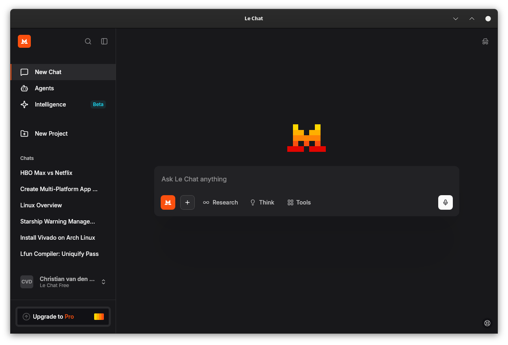

# Le Chat Desktop

A lightweight cross-platform desktop app for Mistral AI's Le Chat (https://chat.mistral.ai/chat) built with Tauri v2.



> **Development Status:** This application is in early development and not fully mature. Some features may not work as expected, and external links (like Mistral Studio) will open in your default browser.

## Features
- Native app for Windows, macOS, and Linux
- Keyboard shortcuts: `Ctrl/Cmd+R` to reload, `Ctrl/Cmd+Shift+I` for DevTools
- Automatic cross-platform builds via GitHub Actions

## Installation

> **Precompiled binaries are available in [Releases](https://github.com/Chri5thian/Le_Chat_App/releases)**

Download the latest release:
- **Windows**: `.msi` or `.exe`
- **macOS**: `.dmg` (Intel & Apple Silicon)
- **Linux**: `.deb` or `.rpm`

## Development

**Prerequisites:**
- [Rust](https://rustup.rs/) toolchain
- Tauri CLI: `cargo install tauri-cli --version ^2 --locked`
- Linux: `libwebkit2gtk-4.1-dev`, `build-essential`, `libssl-dev`, `libayatana-appindicator3-dev`, `librsvg2-dev`

**Run:**
```bash
cargo tauri dev
```

**Build:**
```bash
cargo tauri build
```

## License
MIT - See [LICENSE](LICENSE) file for details.

## Attribution & Trademark Notice
- **Le Chat & Mistral AI**: This is an unofficial third-party desktop wrapper for [Mistral AI's Le Chat](https://chat.mistral.ai).
- **Mistral Logo**: The Mistral AI logo used in this application is the property of Mistral AI. This project is not affiliated with, endorsed by, or connected to Mistral AI.
- **Disclaimer**: This application is a wrapper that loads Mistral's web service. All AI responses and services are provided by Mistral AI.

**Note to Mistral AI:** If you have any concerns about this project, please feel free to open an issue. I'd also welcome the opportunity to discuss this work with your team.

I created this wrapper because I've found desktop applications like ChatGPT and Copilot to be more practical and professional for daily use, offering benefits such as better system integration and local inference capabilities. As a European, I'm also mindful of the importance of supporting European AI companies in an landscape increasingly dominated by US and Chinese platforms. I hope this project might demonstrate the value of a native desktop experience for Le Chat users, and perhaps inspire consideration of an official desktop client in the future. I'd be honored to collaborate or contribute to such an effort if it aligns with your roadmap.
